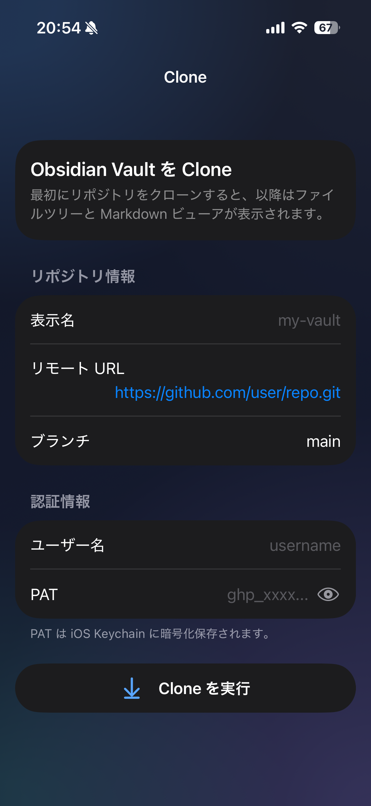
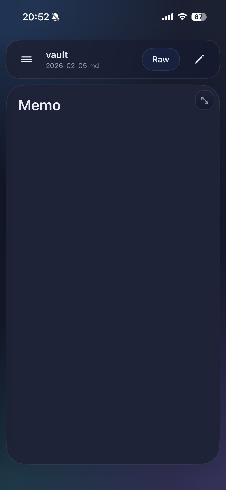

# Obgit

**Obgit** is an iOS app for syncing your [Obsidian](https://obsidian.md) vault with a Git repository. Clone via HTTPS or SSH, pull updates, edit notes, commit, and push — all from your iPhone or iPad.

> Obsidian for iOS does not natively support Git sync. Obgit fills that gap.

---

## Screenshots

| Clone | Workspace | Sidebar |
|:---:|:---:|:---:|
|  |  |  |

> Screenshots will be added after the first TestFlight build.

---

## Features

### Git Operations

- **Clone** via HTTPS (Personal Access Token) or SSH (private key + optional passphrase)
- **Pull** with automatic merge analysis:
  - Fast-forward — automatic hard reset, no user action needed
  - 3-way merge — automatic merge commit when conflict-free
  - Merge conflicts — interactive per-section resolution UI
- **Commit & Push** with AI-generated or template-based commit messages
- **Branch switching** across remote branches
- **Commit history** viewer

### Editor & Viewer

- **Markdown viewer** — rendered preview and raw text toggle
- **Diff view** — unified diff powered by a pure-Swift Myers O(ND) implementation
- **Image viewer** — pinch-to-zoom, pan, double-tap zoom (PNG, JPEG, GIF, WebP, HEIC, TIFF, BMP)
- **WikiLink** conversion (`[[note]]` and `[[note|Display Text]]` → rendered link)
- **YAML frontmatter** stripping before rendering

### Workspace

- **File tree sidebar** — swipe from the left edge to open
- **Full-text search** across all `.md` files (debounced, background thread)
- **Multiple repositories** — manage several vaults side-by-side
  - Long-press a repository to edit its settings or delete it
- **Dark / Light / System** appearance toggle

### AI Commit Messages

Requires an Apple Intelligence–capable device running **iOS 26+**. Falls back to ten built-in templates on unsupported devices.

---

## Requirements

| | Minimum |
|---|---|
| iOS | 18.0+ |
| Xcode | 26.0+ (Swift 6) |
| Device | Any iPhone or iPad |

---

## Build

1. Clone this repository.
2. Open `Obgit.xcodeproj` in Xcode 26+.
3. Select your development team in **Signing & Capabilities**.
4. Build and run on a physical device or Simulator (iOS 18+).

> **Simulator limitation:** `Clibgit2.xcframework` ships device-arm64 slices only.
> SSH clone, pull, push, and branch operations must be tested on a **physical iPhone or iPad**.
> UI-only changes can be prototyped in Simulator.

### Dependencies (resolved automatically by Xcode)

| Package | Branch | Purpose |
|---|---|---|
| [light-tech/SwiftGit2](https://github.com/light-tech/SwiftGit2) | `spm` | HTTPS `git clone` |
| [light-tech/Clibgit2](https://github.com/light-tech/Clibgit2) | `master` | `git fetch` / `git merge` / `git push` (C API) |
| [gonzalezreal/swift-markdown-ui](https://github.com/gonzalezreal/swift-markdown-ui) | `main` | Markdown rendering |

---

## Architecture

```
Obgit/
├── Models/
│   ├── RepositoryModel.swift          # Repository metadata (UserDefaults)
│   ├── VaultFileNode.swift            # File-tree node + recursive builder
│   ├── CommitEntry.swift              # Commit history entry
│   ├── DiffModels.swift               # Diff display models
│   └── ConflictFile.swift             # Merge conflict resolution model
├── Services/
│   ├── GitService.swift               # Clone / Pull / Commit / Push (libgit2 C API)
│   ├── GitError.swift                 # Typed error enum (24 cases, localized)
│   ├── KeychainService.swift          # Credential storage (iOS Keychain)
│   ├── DiffEngine.swift               # Myers O(ND) diff algorithm (pure Swift)
│   ├── MarkdownProcessor.swift        # Frontmatter stripper + WikiLink converter
│   └── CommitMessageGenerator.swift   # Apple Intelligence commit message generation
├── Stores/
│   └── RepositoryStore.swift          # CRUD + UserDefaults persistence
├── ViewModels/
│   ├── CloneRepositoryViewModel.swift
│   ├── VaultWorkspaceViewModel.swift
│   ├── RepositoryDetailViewModel.swift
│   ├── RepositoryListViewModel.swift
│   └── SearchViewModel.swift
└── Views/
    ├── VaultHomeView.swift            # Root: Clone screen or Workspace shell
    ├── CommitDialogView.swift         # Commit & push + AI message generation
    ├── ConflictResolutionSheet.swift  # Interactive merge conflict resolution
    ├── DiffSheet.swift                # Diff viewer
    ├── BranchSwitchSheet.swift        # Remote branch list + switch
    ├── CommitHistorySheet.swift       # Commit log
    ├── SearchView.swift               # Full-text search
    └── ObgitLiquidStyle.swift         # Design system (color palette)
```

Key design decisions are documented in [CONTRIBUTING.md](CONTRIBUTING.md#key-design-decisions).

---

## Security

- **PAT and SSH private keys** are stored exclusively in the **iOS Keychain** using `kSecClassGenericPassword` with `kSecAttrAccessibleAfterFirstUnlockThisDeviceOnly`.
- SSH private keys are **never written to disk**. They are loaded from Keychain into memory and passed directly to libgit2 via `git_cred_ssh_key_memory_new()`.
- Network communication uses the OS-level TLS stack (HTTPS) or libgit2's SSH implementation.

To report a security vulnerability, see [SECURITY.md](SECURITY.md).

---

## Contributing

Contributions are welcome. See [CONTRIBUTING.md](CONTRIBUTING.md) for guidelines.

---

## License

MIT License — see [LICENSE](LICENSE).

This project uses third-party libraries. Their licenses are listed in the [Notices](#notices) section of the LICENSE file.
